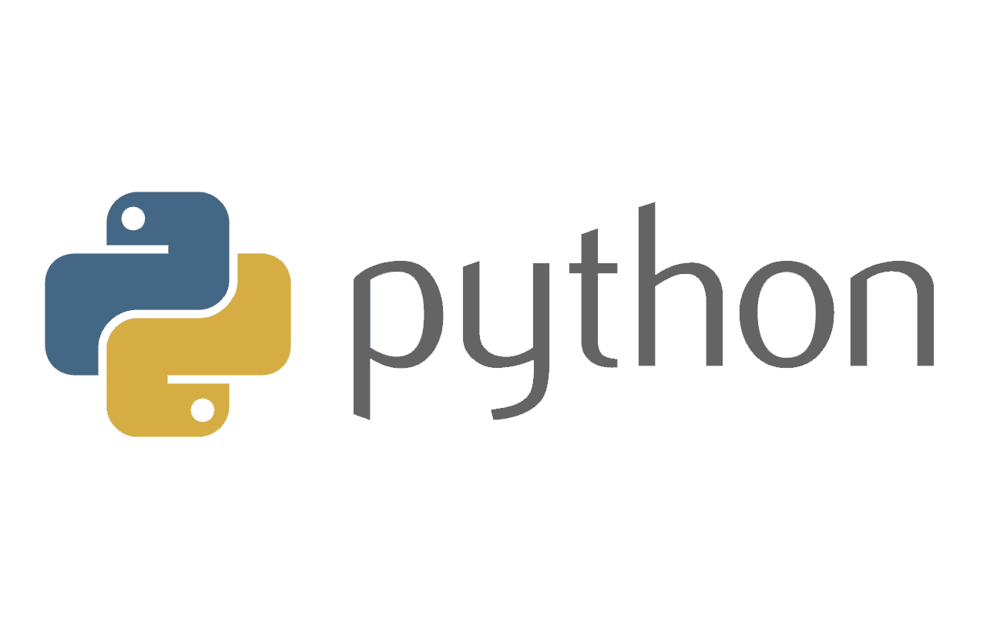

# Study-Group-GitHalex

> Todo lo que escuchamos es una opinión, no un hecho. Todo lo que vemos es una perspectiva, no la verdad. - Marco Aurelio.
> Marco Aurelio.

| Columna 1 | Columna 2 | Columna 3 |
| --------- | --------- | --------- |
| A         | B         | C         |
| D         | E         | F         |
| G         | H         | I         |

1. primarvera
2. verano
3. otoño

listas No Ordenadas

- primavera

Esto es `código` en línea.

En _**Python**_ una variable se define así: `saludo = "Hola Mundo";`.

```py
def sumar(a, b) {
  return a + b
}

sumar(3, 2)
```

enlaces

[Python](python.org)


